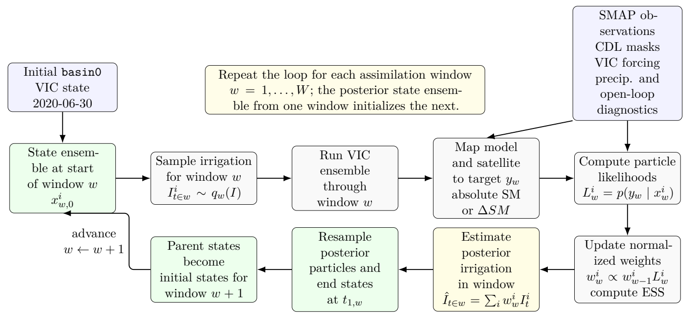
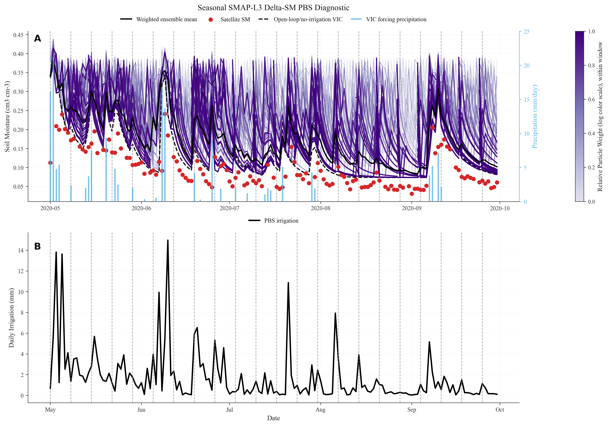

# Irrigation Estimates

Scripts and documentation for estimating irrigation water input in the Dry Spottedtail Creek / Middle North Platte-Scotts Bluff region using VIC particle ensembles and SMAP soil-moisture observations.

The current working approach is a particle batch smoother (PBS): each particle represents one possible irrigation history, VIC translates that history into soil moisture, SMAP observations constrain which particles are plausible, and posterior particle weights are traced back to irrigation inputs.

## Repository Layout

```text
scripts/
  satellite/      SMAP L3 extraction, CDL masking, HUC8 Delta-SM target building
  pbs/            PBS likelihoods, particle scoring, irrigation summaries
  hpc/            Hopper upload/run/retrieval scripts
  plotting/       PBS diagnostic and technical-report figures
  calibration/    ET/soil-moisture calibration utilities retained from earlier work
  utilities/      VIC export/helper scripts

docs/
  technical_report/   Current LaTeX technical report and report figures

config/
  research_report.mplstyle
```

Large raw datasets, VIC run folders, weekly scratch directories, extracted archives, and generated local outputs are intentionally excluded from git. See `.gitignore`.

## Current PBS Workflow



The final Delta-SM workflow scores particles on changes in soil moisture rather than absolute soil-moisture levels:

```text
residual = Delta_SM_satellite_cropland - Delta_SM_particle_VIC
```

Within each weekly PBS window, daily same-cell/same-period SMAP L3 changes are aggregated over cropland-like HUC8 cells using CDL overlap-area weights. Particle likelihoods use a Gaussian Delta-SM residual model with the current working scale:

```text
sigma_Delta_SM = 0.075 m3/m3
```

After each weekly likelihood update, particles are resampled and the selected end-of-window VIC state files initialize the next weekly ensemble.

## Main Results To Date

| Experiment | Period | Observation target | Prior irrigation | Posterior irrigation | Notes |
|---|---:|---|---:|---:|---|
| Absolute-SM sequential PBS | 2020-07-01 to 2020-07-28 | Absolute SM + MLP bias mapping | 116.48 mm | 0.05 mm | Collapsed toward near-zero irrigation, likely due to VIC-SMAP level mismatch. |
| AdaPBS-style pooled absolute-SM | 2020-07-01 to 2020-07-28 | Absolute SM + MLP bias mapping | 76.38 mm | 1.45 mm | Improved ESS but retained near-zero posterior. |
| Daily Delta-SM sequential PBS | 2020-07-01 to 2020-07-28 | Cropland-only SMAP L3 Delta-SM | 118.98 mm | 41.14 mm | First successful resample/rerun Delta-SM test. |
| Full-season Daily Delta-SM sequential PBS | 2020-05-01 to 2020-09-30 | Cropland-only SMAP L3 Delta-SM | 664.76 mm | 260.33 mm | Used one-year zero-irrigation VIC spin-up from 2019-05-01 to 2020-04-30. |

The full-season run is the strongest demonstration so far, but it is not yet a validated irrigation estimate. Validation against independent irrigation or water-use data is the next step.



## Key Scripts

Satellite and target preparation:

```text
scripts/satellite/download_extract_huc8_smap_l3.py
scripts/satellite/build_huc8_daily_delta_targets.py
scripts/satellite/preprocess_cropland_mask.py
```

Sequential PBS:

```text
scripts/pbs/pbs_generate_irrigation_window_table.py
scripts/pbs/pbs_prepare_vic_window_from_irrigation_table.py
scripts/pbs/score_hopper_daily_delta_sm_window.py
scripts/pbs/summarize_daily_delta_resample_rerun.py
```

Hopper full-season run:

```text
scripts/hpc/prepare_full_season_delta_sm_pbs.ps1
scripts/hpc/run_hopper_daily_delta_sm_resample_rerun_basin0_season.sh
scripts/hpc/retrieve_season_delta_resample_rerun_results.ps1
```

Figures:

```text
scripts/plotting/plot_abolafia_rosenzweig_style_pbs_diagnostic.py
scripts/plotting/plot_abolafia_rosenzweig_style_delta_sm_pbs_diagnostic.py
scripts/plotting/plot_seasonal_delta_sm_pbs_diagnostic.py
```

## Technical Report

The current LaTeX report is in:

```text
docs/technical_report/pbs_framework_technical_report.tex
```

It summarizes the absolute-SM trials, the Delta-SM PBS framework, the July proof-of-concept run, and the May-September 2020 full-season extension.
